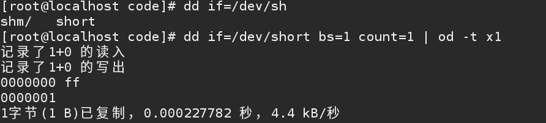

## IO 通信

每种外设都能通过读写寄存器进行控制。大部分外设都有几个寄存器。不管在内存地址还是IO地址空间都是连续的。

ISA设备    IO端口方案

PCI设备    将寄存器映射到内存区段

### io寄存器和传统内存对比

IO寄存器和传统内存对比  
        尽管硬件寄存器和内存之间有很强的相似性, 程序员在存取 I/O 寄存器的时候还是要格外小心，避免被CPU(或者编译器)优化所迷惑, 因为它可能修改你期待的 I/O 行为.
        I/O 寄存器和 RAM 一个主要的不同是：I/O 操作会带来副作用, 而内存操作没有。一个内存写操作的唯一效果是存储一个值到某个地址, 并且一个内存读操作返回上次写到该地址的值. 由于内存存取速度对CPU 性能是至关重要的, 这种无副作用的操作已被多种方式优化: 值被缓存, 并且读/写指令被重新编排.编译器能够缓存数据值到CPU 寄存器而不写到内存, 并且即使数据值已经存储到内存, 读和写操作都能够在缓冲内存中进行而不是直接接触物理RAM. 此外，指令重编排可能在编译器级别或在硬件级别发生: 很多情况下，如果一个指令以不同于在程序文本中出现的顺序来执行（例如, 为避免在 RISC 流水线中的互锁），它能够执行得更快,对于传统内存(至少在单处理器系统)来说，这些优化是透明和有益的。驱动直接存取I/O寄存器的主要目的是能提高CPU性能。然而，这些优化对正确的 I/O 操作可能是致命的. 处理器无法预见这种情形, 一些其他的操作(在一个独立处理器上运行, 或者发生在一个 I/O 控制器的事情)依赖内存存取的顺序. 编译器或者 CPU 可能只尽力胜过你并且重编排你请求的操作; 结果可能是奇怪的错误而非常难于调试. 因此, 一个驱动必须确保没有进行缓冲并且在存取寄存器时没有发生读或写的重编排.
        
        
### 解决方法：内存屏障（解决IO 寄存器被优化的问题）

内存屏障(Memory Barriers)
一方面，CPU由于采用指令流水线和超流水线技术，可能导致CPU虽然顺序取指令、但有可能会出现“乱序”执行的情况，当然，对于” a++；b = f(a)；c = f”等存在依赖关系的指令，CPU则会在“b= f(a)”执行阶段之前被阻塞；另一方面，编译器也有可能将依赖关系很近“人为地”拉开距离以防止阻塞情况的发生，从而导致编译器乱序，如“a++ ；c = f；b = f(a)”。
一个CPU对指令顺序提供如下保证：

(1) On any given CPU, dependent memory accesses will be issued in order, with respect to itself.如Q = P; D = *Q;将保证其顺序执行

(2) Overlapping loads and stores within a particular CPU will appear to be ordered within that CPU.重叠的Load和Store操作将保证顺序执行（目标地址相同的Load、Store），如：a = *X; *X = b;

(3) It _must_not_ be assumed that independent loads and stores will be issued in the order given.

(4) It _must_ be assumed that overlapping memory accesses may be merged or discarded.如*A = X; Y = *A; => STORE *A = X; Y = LOAD *A; / or STORE *A = Y = X;
 
由此可见，无关的内存操作会被按随机顺序有效的得到执行,但是在CPU与CPU交互时或CPU与IO设备交互时, 这可能会成为问题. 我们需要一些手段来干预编译器和CPU, 使其限制指令顺序。内存屏障就是这样的干预手段. 他们能保证处于内存屏障两边的内存操作满足部分有序.(译注: 这里"部分有序"的意思是, 内存屏障之前的操作都会先于屏障之后的操作, 但是如果几个操作出现在屏障的同一边, 则不保证它们的顺序.)
(1) 写(STORE)内存屏障。在写屏障之前的STORE操作将先于所有在写屏障之后的STORE操作。
(2) 数据依赖屏障。两条Load指令，第二条Load指令依赖于第一条Load指令的结果，则数据依赖屏障保障第二条指令的目标地址将被更新。
(3) 读(LOAD)内存屏障。读屏障包含数据依赖屏障的功能, 并且保证所有出现在屏障之前的LOAD操作都将先于所有出现在屏障之后的LOAD操作被系统中的其他组件所感知.
(4) 通用内存屏障. 通用内存屏障保证所有出现在屏障之前的LOAD和STORE操作都将先于所有出现在屏障之后的LOAD和STORE操作被系统中的其他组件所感知.
(5) LOCK操作.它的作用相当于一个单向渗透屏障.它保证所有出现在LOCK之后的内存操作都将在LOCK操作被系统中的其他组件所感知之后才能发生. 出现在LOCK之前的内存操作可能在LOCK完成之后才发生.LOCK操作总是跟UNLOCK操作配对出现.
(6) UNLOCK操作。它保证所有出现在UNLOCK之前的内存操作都将在UNLOCK操作被系统中的其他组件所感知之前发生.

### 简单IO端口访问程序结构

ps: struct file -> path -> dentry -> inode

ps : disabled rmmove https://lwn.net/Articles/380931/

