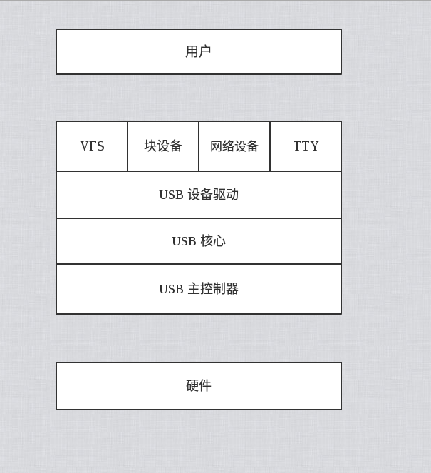

## USB 驱动程序

### USB的一般化定义
（概念来源于互联网资料）

从1994年11月11日发表了USB V0.7版本以后，USB版本经历了多年的发展，已经发展为3.1版本，成为二十一世纪电脑中的标准扩展接口。当前（2016年）主板中主要是采用USB2.0和USB3.0接口，各USB版本间能很好的兼容。USB用一个4针（USB3.0标准为9针）插头作为标准插头，采用菊花链形式可以把所有的外设连接起来，最多可以连接127个外部设备，并且不会损失带宽。USB需要主机硬件、操作系统和外设三个方面的支持才能工作。二十一世纪的主板一般都采用支持USB功能的控制芯片组，主板上也安装有USB接口插座，而且除了背板的插座之外，主板上还预留有USB插针，可以通过连线接到机箱前面作为前置USB接口以方便使用（注意，在接线时要仔细阅读主板说明书并按图连接，千万不可接错而使设备损坏）。而且USB接口还可以通过专门的USB连机线实现双机互连，并可以通过Hub扩展出更多的接口。USB具有传输速度快，使用方便，支持热插拔，连接灵活，独立供电等优点，可以连接鼠标、键盘、打印机、扫描仪、摄像头、充电器、闪存盘、MP3机、手机、数码相机、移动硬盘、外置光驱/软驱、USB网卡、ADSL Modem、Cable Modem等，几乎所有的外部设备。
理论上USB接口可用于连接多达127个外设，如鼠标、调制解调器和键盘等。USB自从1996年推出后，已成功替代串口和并口，并成为二十一世纪个人电脑和大量智能设备的必配的接口之一。


### 软件结构
每个USB只有一个主机，它包括以下几层：
总线接口
USB总线接口处理电气层与协议层的互连。从互连的角度来看，相似的总线接口由设备及主机同时给出，例如串行接口机（SIE）。USB总线接口由主控制器实现。
USB系统用主控制器管理主机与USB设备间的数据传输。它与主控制器间的接口依赖于主控制器的硬件定义。同时，USB系统也负责管理USB资源，例如带宽和总线能量，这使客户访问USB成为可能。

USB系统还有三个基本组件：

1.主控制器驱动程序（HCD）这可把不同主控制器设备映射到USB系统中。HCD与USB之间的接口叫HCDI，特定的HCDI由支持不同主控制器的操作系统定义，通用主控制器驱动器（UHCD）处于软结构的最底层，由它来管理和控制主控制器。UHCD实现了与USB主控制器通信和控制。

2.USB主控制器，并且它对系统软件的其他部分是隐蔽的。系统软件中的最高层通过UHCD的软件接口与主控制器通信。

3.USB驱动程序（USBD）它在UHCD驱动器之上，它提供驱动器级的接口，满足现有设备驱动器设计的要求。USBD以I/O请求包（IRPs）的形式提供数据传输架构，它由通过特定管道（Pipe）传输数据的需求组成。此外，USBD使客户端出现设备的一个抽象，以便于抽象和管理。作为抽象的一部分，USBD拥有缺省的管道。通过它可以访问所有的USB设备以进行标准的USB控制。该缺省管道描述了一条USBD和USB设备间通信的逻辑通道。

主机软件

在某些操作系统中，没有提供USB系统软件。这些软件本来是用于向设备驱动程序提供配置信息和装载结构的。在这些操作系统中，设备驱动程序将应用提供的接口而不是直接访问USBDI（USB驱动程序接口）结构。

USB客户软件

它是位于软件结构的最高层，负责处理特定USB设备驱动器。客户程序层描述所有直接作用于设备的软件入口。当设备被系统检测到后，这些客户程序将直接作用于外围硬件。这个共享的特性将USB系统软件置于客户和它的设备之间，这就要根据USBD在客户端形成的设备映像由客户程序对它进行处理。

主机各层有以下功能：

1.检测连接和移去的USB设备。

2.管理主机和USB设备间的数据流。

3.连接USB状态和活动统计。

4.控制主控制器和USB设备间的电气接口，包括限量能量供应。

5.HCD提供了主控制器的抽象和通过USB传输的数据的主控制器视角的一个抽象。USBD提供了USB设备的抽象和USBD客户与USB功能间数据
6.传输的一个抽象。USB系统促进客户和功能间的数据传输，并作为USB设备的规范接口的一个控制点。USB系统提供缓冲区管理能力并允许数据传输同步于客户和功能的需求。
### 硬件结构
USB采用四线电缆，其中两根是用来传送数据的串行通道，另两根为下游（Downstream）设备提供电源，对于任何已经成功连接且相互识别的外设，将以双方设备均能够支持的最高速率传输数据。USB总线会根据外设情况在所兼容的传输模式中自动地由高速向低速动态转换且匹配锁定在合适的速率。

USB是基于令牌的总线。类似于令牌环网络或FDDI基于令牌的总线。USB主控制器广播令牌，总线上设备检测令牌中的地址是否与自身相符，通过接收或发送数据给主机来响应。USB通过支持悬挂/恢复操作来管理USB总线电源。USB系统采用级联星型拓扑，该拓扑由三个基本部分组成：主机（Host），集线器（Hub）和功能设备。


主机，也称为根，根结或根Hub，它做在主板上或作为适配卡安装在计算机上，主机包含有主控制器和根集线器（Root Hub），控制着USB

总线上的数据和控制信息的流动，每个USB系统只能有一个根集线器，它连接在主控制器上，一台计算机可能有多个根集线器。

集线器是USB结构中的特定成分，它提供叫做端口（Port）的点将设备连接到USB总线上，同时检测连接在总线上的设备，并为这些设备提供

电源管理，负责总线的故障检测和恢复。集线可为总线提供能源，亦可为自身提供能源（从外部得到电源）。
功能设备通过端口与总线连接。USB同时可做Hub使用。

### 数据传输
主控制器负责主机和USB设备间数据流的传输。这些传输数据被当作连续的比特流。每个设备提供了一个或多个可以与客户程序通信的接口，每个接口由0个或多个管道组成，它们分别独立地在客户程序和设备的特定终端间传输数据。USBD为主机软件的现实需求建立了接口和管道，当提出配置请求时，主控制器根据主机软件提供的参数提供服务。
USB支持四种基本的数据传输模式：控制传输，等时传输，中断传输及数据块传输。每种传输模式应用到具有相同名字的终端，则具有不同的性质。
控制传输类型
支持外设与主机之间的控制，状态，配置等信息的传输，为外设与主机之间提供一个控制通道。每种外设都支持控制传输类型，这样主机与外设之间就可以传送配置和命令/状态信息。
等时（lsochronous）传输类型（或称同步传输）
支持有周期性，有限的时延和带宽且数据传输速率不变的外设与主机间的数据传输。该类型无差错校验，故不能保证正确的数据传输，支持像计算机－电话集成系统（CTI）和音频系统与主机的数据传输。
中断传输类型
支持像游戏手柄，鼠标和键盘等输入设备，这些设备与主机间数据传输量小，无周期性，但对响应时间敏感，要求马上响应。
数据块（Bulk）传输类型
支持打印机，扫描仪，数码相机等外设，这些外设与主机间传输的数据量大，USB在满足带宽的情况下才进行该类型的数据传输。
USB采用分块带宽分配方案，若外设超过当前带宽分配或潜在的要求，则不能进入该设备。同步和中断传输类型的终端保留带宽，并保证数据按一定的速率传送。集中和控制终端按可用的最佳带宽来传输传输数据。


### USB 驱动程序架构



USB 核心为驱动程序提供了一个用于访问控制的统一USB硬件接口。


### USB 端点

USB通信的最基本形式通过端点来，只能向一个方向传送数据，从主机到设备或者从设备到主机。共有4种类型。

控制：控制对于USB不同部分的访问。

中断：每当USB宿主要求传输时，以一个固定的速率传输少量数据。

批量：传输大批量的数据。

等时：传输大批量数据，到达没有保正。

代码结构：

```
/**
 * struct usb_host_endpoint - host-side endpoint descriptor and queue
 * @desc: descriptor for this endpoint, wMaxPacketSize in native byteorder
 * @ss_ep_comp: SuperSpeed companion descriptor for this endpoint
 * @urb_list: urbs queued to this endpoint; maintained by usbcore
 * @hcpriv: for use by HCD; typically holds hardware dma queue head (QH)
 *	with one or more transfer descriptors (TDs) per urb
 * @ep_dev: ep_device for sysfs info
 * @extra: descriptors following this endpoint in the configuration
 * @extralen: how many bytes of "extra" are valid
 * @enabled: URBs may be submitted to this endpoint
 * @streams: number of USB-3 streams allocated on the endpoint
 *
 * USB requests are always queued to a given endpoint, identified by a
 * descriptor within an active interface in a given USB configuration.
 */
struct usb_host_endpoint {   //usb  节点
	struct usb_endpoint_descriptor		desc;
	struct usb_ss_ep_comp_descriptor	ss_ep_comp;
	struct list_head		urb_list;
	void				*hcpriv;
	struct ep_device		*ep_dev;	/* For sysfs info */

	unsigned char *extra;   /* Extra descriptors */
	int extralen;
	int enabled;
	int streams;
};

```

```
/* USB_DT_ENDPOINT: Endpoint descriptor */ usb真正端点信息
struct usb_endpoint_descriptor {
	__u8  bLength;
	__u8  bDescriptorType;

	__u8  bEndpointAddress;  /*特定端点USB地址*/
	__u8  bmAttributes;      /*端点类型*/
	__le16 wMaxPacketSize;
	__u8  bInterval;

	/* NOTE:  these two are _only_ in audio endpoints. */
	/* use USB_DT_ENDPOINT*_SIZE in bLength, not sizeof. */
	__u8  bRefresh;
	__u8  bSynchAddress;
} __attribute__ ((packed));
```

### 接口

USB端点被捆绑为接口。内核使用struct usb_interface 结构来描述USB接口。

```
/**
 * struct usb_interface - what usb device drivers talk to
 * @altsetting: array of interface structures, one for each alternate
 *	setting that may be selected.  Each one includes a set of
 *	endpoint configurations.  They will be in no particular order.
 * @cur_altsetting: the current altsetting.
 * @num_altsetting: number of altsettings defined.
 * @intf_assoc: interface association descriptor
 * @minor: the minor number assigned to this interface, if this
 *	interface is bound to a driver that uses the USB major number.
 *	If this interface does not use the USB major, this field should
 *	be unused.  The driver should set this value in the probe()
 *	function of the driver, after it has been assigned a minor
 *	number from the USB core by calling usb_register_dev().
 * @condition: binding state of the interface: not bound, binding
 *	(in probe()), bound to a driver, or unbinding (in disconnect())
 * @sysfs_files_created: sysfs attributes exist
 * @ep_devs_created: endpoint child pseudo-devices exist
 * @unregistering: flag set when the interface is being unregistered
 * @needs_remote_wakeup: flag set when the driver requires remote-wakeup
 *	capability during autosuspend.
 * @needs_altsetting0: flag set when a set-interface request for altsetting 0
 *	has been deferred.
 * @needs_binding: flag set when the driver should be re-probed or unbound
 *	following a reset or suspend operation it doesn't support.
 * @authorized: This allows to (de)authorize individual interfaces instead
 *	a whole device in contrast to the device authorization.
 * @dev: driver model's view of this device
 * @usb_dev: if an interface is bound to the USB major, this will point
 *	to the sysfs representation for that device.
 * @pm_usage_cnt: PM usage counter for this interface
 * @reset_ws: Used for scheduling resets from atomic context.
 * @resetting_device: USB core reset the device, so use alt setting 0 as
 *	current; needs bandwidth alloc after reset.
 *
 * USB device drivers attach to interfaces on a physical device.  Each
 * interface encapsulates a single high level function, such as feeding
 * an audio stream to a speaker or reporting a change in a volume control.
 * Many USB devices only have one interface.  The protocol used to talk to
 * an interface's endpoints can be defined in a usb "class" specification,
 * or by a product's vendor.  The (default) control endpoint is part of
 * every interface, but is never listed among the interface's descriptors.
 *
 * The driver that is bound to the interface can use standard driver model
 * calls such as dev_get_drvdata() on the dev member of this structure.
 *
 * Each interface may have alternate settings.  The initial configuration
 * of a device sets altsetting 0, but the device driver can change
 * that setting using usb_set_interface().  Alternate settings are often
 * used to control the use of periodic endpoints, such as by having
 * different endpoints use different amounts of reserved USB bandwidth.
 * All standards-conformant USB devices that use isochronous endpoints
 * will use them in non-default settings.
 *
 * The USB specification says that alternate setting numbers must run from
 * 0 to one less than the total number of alternate settings.  But some
 * devices manage to mess this up, and the structures aren't necessarily
 * stored in numerical order anyhow.  Use usb_altnum_to_altsetting() to
 * look up an alternate setting in the altsetting array based on its number.
 */
struct usb_interface {
	/* array of alternate settings for this interface,
	 * stored in no particular order */
	struct usb_host_interface *altsetting;

	struct usb_host_interface *cur_altsetting;	/* the currently
					 * active alternate setting */
	unsigned num_altsetting;	/* number of alternate settings */

	/* If there is an interface association descriptor then it will list
	 * the associated interfaces */
	struct usb_interface_assoc_descriptor *intf_assoc;

	int minor;			/* minor number this interface is
					 * bound to */
	enum usb_interface_condition condition;		/* state of binding */
	unsigned sysfs_files_created:1;	/* the sysfs attributes exist */
	unsigned ep_devs_created:1;	/* endpoint "devices" exist */
	unsigned unregistering:1;	/* unregistration is in progress */
	unsigned needs_remote_wakeup:1;	/* driver requires remote wakeup */
	unsigned needs_altsetting0:1;	/* switch to altsetting 0 is pending */
	unsigned needs_binding:1;	/* needs delayed unbind/rebind */
	unsigned resetting_device:1;	/* true: bandwidth alloc after reset */
	unsigned authorized:1;		/* used for interface authorization */

	struct device dev;		/* interface specific device info */
	struct device *usb_dev;
	atomic_t pm_usage_cnt;		/* usage counter for autosuspend */
	struct work_struct reset_ws;	/* for resets in atomic context */
};
```

### 配置

USB 接口本身被捆绑为配置。

内核使用usb_host_config 描述USB配置，使用struct usb_device 结构体描述整个USB 设备。

### 概述USB

设备通常有一个或多个配置

配置经常具有一个或者多个更多的接口

接口通常具有一个或多个更多配置

接口没有或者具有一个以上的端点 


### URB 

usb请求块urb（usb request block,urb）是usb设备驱动中用来描述与usb设备通信所用的基本载体和核心数据结构。
是usb主机和设备通信的“电波”。


一个 urb 用来发送或接受数据到或者从一个特定 USB 设备上的特定的 USB 端点, 以一种异步的方式. 它用起来非常象一个 kiocb 结构被用在文件系统异步 I/O 代码, 或者如同一个 struct skbuff 用在网络代码中. 一个 USB 设备驱动可能分配许多 urb 给一个端点或者可能重用单个 urb 给多个不同的端点, 根据驱动的需要. 设备中的每个端点都处理一个 urb 队列, 以至于多个 urb 可被发送到相同的端点, 在队列清空之前. 一个 urb 的典型生命循环如下:

1.由一个 USB 设备驱动创建.

2.分配给一个特定 USB 设备的特定端点.

3.由USB设备驱动程序提交到USB核心。

4.提交给特定设备的被 USB 核心指定的 USB 主机控制器驱动, .

5.由USB 主机控制器处理, 它从设备进行USB传送。

6.当 urb 完成, USB 主机控制器驱动通知 USB 设备驱动程序.


#### struct urb

```
struct urb {
	/* private: usb core and host controller only fields in the urb */
	struct kref kref;		/* reference count of the URB */
	void *hcpriv;			/* private data for host controller */
	atomic_t use_count;		/* concurrent submissions counter */
	atomic_t reject;		/* submissions will fail */
	int unlinked;			/* unlink error code */

	/* public: documented fields in the urb that can be used by drivers */
	struct list_head urb_list;	/* list head for use by the urb's
					 * current owner */
	struct list_head anchor_list;	/* the URB may be anchored */
	struct usb_anchor *anchor;
	struct usb_device *dev;		/* (in) pointer to associated device */
	struct usb_host_endpoint *ep;	/* (internal) pointer to endpoint */
	unsigned int pipe;		/* (in) pipe information */
	unsigned int stream_id;		/* (in) stream ID */
	int status;			/* (return) non-ISO status */
	unsigned int transfer_flags;	/* (in) URB_SHORT_NOT_OK | ...*/
	void *transfer_buffer;		/* (in) associated data buffer */
	dma_addr_t transfer_dma;	/* (in) dma addr for transfer_buffer */
	struct scatterlist *sg;		/* (in) scatter gather buffer list */
	int num_mapped_sgs;		/* (internal) mapped sg entries */
	int num_sgs;			/* (in) number of entries in the sg list */
	u32 transfer_buffer_length;	/* (in) data buffer length */
	u32 actual_length;		/* (return) actual transfer length */
	unsigned char *setup_packet;	/* (in) setup packet (control only) */
	dma_addr_t setup_dma;		/* (in) dma addr for setup_packet */
	int start_frame;		/* (modify) start frame (ISO) */
	int number_of_packets;		/* (in) number of ISO packets */
	int interval;			/* (modify) transfer interval
					 * (INT/ISO) */
	int error_count;		/* (return) number of ISO errors */
	void *context;			/* (in) context for completion */
	usb_complete_t complete;	/* (in) completion routine */
	struct usb_iso_packet_descriptor iso_frame_desc[0];
					/* (in) ISO ONLY */
};
```

这个结构体在"linux/usb.h" 中，在源码中每一项内容都有详细的说明，我们不再此讨论。

#### usb的操作

创建和销毁一个URB 注意此处内部使用引用计数机制，我们必须使用创建函数创建。

```
struct urb * usb_alloc(int iso_packets,int mem_flags);
```
@iso_packets  等时数据包量

@mem_flags    内核内存分配标志

放弃一个URB 

```
void usb_free(struct urb *urb);
```
中断 urb

函数 usb_fill_int_urb 是一个帮忙函数, 来正确初始化一个urb 来发送给 USB 设备的一个中断端点:
```
void usb_fill_int_urb(struct urb *urb, struct usb_device *dev,
unsigned int pipe, void *transfer_buffer,
int buffer_length, usb_complete_t complete,void *context, int interval);
```

这个函数包含许多参数:
struct urb *urb 指向要被初始化的 urb 的指针.

struct usb_device *dev这个 urb 要发送到的 USB 设备.

unsigned int pipe这个 urb 要被发送到的 USB 设备的特定端点. 这个值被创建, 使用前面提过的 usb_sndintpipe 或者
usb_rcvintpipe 函数.

void *transfer_buffer指向缓冲的指针, 从那里外出的数据被获取或者进入数据被接受. 注意这不能是一个静态的缓冲并且必须使用 kmalloc 调用来创建.

int buffer_length缓冲的长度, 被 transfer_buffer 指针指向.

usb_complete_t complete指针, 指向当这个 urb 完成时被调用的完成处理者.

void *context指向数据块的指针, 它被添加到这个 urb 结构为以后被完成处理者函数获取.

int interval这个 urb 应当被调度的间隔. 见之前的 struct urb 结构的描述, 来找到这个值的正确单位.

批量 urb

块 urb 被初始化非常象中断 urb. 做这个的函数是 usb_fill_bulk_urb, 它看来如此:
```
void usb_fill_bulk_urb(struct urb *urb, struct usb_device *dev,
unsigned int pipe, void *transfer_buffer,
int buffer_length, usb_complete_t complete,void *context);
```

这个函数参数和 usb_fill_int_urb 函数的都相同. 但是, 没有 interval 参数因为 bulk urb 没有间隔值. 请注意这个 unsiged int pipe 变量必须被初始化用对 usb_sndbulkpipe 或者 usb_rcvbulkpipe 函数的调用.

usb_fill_int_urb 函数不设置 urb 中的 transfer_flags 变量, 因此任何对这个成员的修改不得不由这个驱动自己完成.

控制 urb

控制 urb 被初始化几乎和 块 urb 相同的方式, 使用对函数 usb_fill_control_urb 的调用:
```
void usb_fill_control_urb(struct urb *urb, struct usb_device *dev,
unsigned int pipe, unsigned char *setup_packet,
void *transfer_buffer, int buffer_length,
usb_complete_t complete, void *context);
```
函数参数和 usb_fill_bulk_urb 函数都相同, 除了有个新参数, unsigned char *setup_packet, 它必须指向要发送给端点的 setup 报文数据. 还有, unsigned int pipe 变量必须被初始化, 使用对 usb_sndctrlpipe 或者 usb_rcvictrlpipe 函数的调用.

usb_fill_control_urb 函数不设置 transfer_flags 变量在 urb 中, 因此任何对这个成员的修改必须游驱动自己完成. 大部分驱动不使用这个函数, 因为使用在"USB 传送不用 urb"一节中介绍的同步 API 调用更简单.

等时urb

不幸的是, 同步 urb 没有一个象中断, 控制, 和块 urb 的初始化函数. 因此它们必须在驱动中"手动"初始化, 在它们可被提交给 USB 核心之前. 下面是一个如何正确初始化这类 urb 的例子. 它是从 konicawc.c 内核驱动中取得的, 它位于主内核源码树的 drivers/usb/media 目录.
```
urb->dev = dev;
urb->context = uvd;
urb->pipe = usb_rcvisocpipe(dev, uvd->video_endp-1);
urb->interval = 1;
urb->transfer_flags = URB_ISO_ASAP;
urb->transfer_buffer = cam->sts_buf[i];
urb->complete = konicawc_isoc_irq;
urb->number_of_packets = FRAMES_PER_DESC;
urb->transfer_buffer_length = FRAMES_PER_DESC;
for (j=0; j < FRAMES_PER_DESC; j++) {
 urb->iso_frame_desc[j].offset = j;
 urb->iso_frame_desc[j].length = 1;
}
```

提交 urb

一旦 urb 被正确地创建,并且被 USB 驱动初始化, 它已准备好被提交给 USB 核心来发送出到 USB 设备. 这通过调用函数 usb_submit_urb 实现:
int usb_submit_urb(struct urb *urb, int mem_flags);
urb 参数是一个指向 urb 的指针, 它要被发送到设备. mem_flags 参数等同于传递给 kmalloc 调用的同样的参数, 并且用来告诉 USB 核心如何及时分配任何内存缓冲在这个时间.

在 urb 被成功提交给 USB 核心之后, 应当从不试图存取 urb 结构的任何成员直到完成函数被调用.
因为函数 usb_submit_urb 可被在任何时候被调用(包括从一个中断上下文), mem_flags 变量的指定必须正确. 真正只有 3 个有效值可用, 根据何时 usb_submit_urb 被调用:

GFP_ATOMIC这个值应当被使用无论何时下面的是真:
调用者处于一个 urb 完成处理者, 一个中断, 一个后半部, 一个 tasklet, 或者一个时钟回调.
调用者持有一个自旋锁或者读写锁. 注意如果正持有一个旗标, 这个值不必要.
current->state 不是 TASK_RUNNING. 状态一直是 TASK_RUNNING 除非驱动已自己改变 current 状态.

GFP_NOIO这个值应当被使用, 如果驱动在块 I/O 补丁中. 它还应当用在所有的存储类型的错误处理补丁中.

GFP_KERNEL这应当用在所有其他的情况中, 不属于之前提到的类别.


