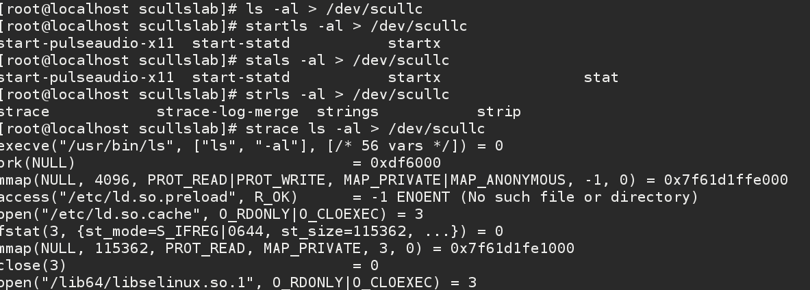

## 内存分配

这里不再讨论具体架构的内存管理问题，内存的具体结构可以参考我对内存关系分析的博客。我们主要来讨论下，一致的内存分配接口问题。


### kmalloc

“include/linux/slab.h”

```
static __always_inline void *kmalloc(size_t size, gfp_t flags)
{
	if (__builtin_constant_p(size)) {
		if (size > KMALLOC_MAX_CACHE_SIZE)
			return kmalloc_large(size, flags);
	}
	return __kmalloc(size, flags);
}

```

两个参数：size : 需要分配的大小， flags: 分配标志 。

GFP_KERNEL 不一直是使用的正确分配标志; 有时 kmalloc 从一个进程的上下文的外部调用. 例如, 这类的调用可能发生在中断处理, tasklet, 和内核定时器中. 在这个情况下, 当前进程不应当被置为睡眠, 并且驱动应当使用一个 GFP_ATOMIC 标志来代替. 内核正常地试图保持一些空闲页以便来满足原子的分配. 当使用 GFP_ATOMIC 时, kmalloc 能够使用甚至最后一个空闲页. 如果这最后一个空闲页不存在, 但是, 分配失败.

其他用来代替或者增添 GFP_KERNEL 和 GFP_ATOMIC 的标志, 尽管它们 2 个涵盖大部分设备驱动的需要. 所有的标志定义在 "linux/gfp.h", 并且每个标志用一个双下划线做前缀, 例如 __GFP_DMA. 另外, 有符号代表常常使用的标志组合; 这些缺乏前缀并且有时被称为分配优先级. 后者包括:

GFP_ATOMIC
用来从中断处理和进程上下文之外的其他代码中分配内存. 从不睡眠.

GFP_KERNEL
内核内存的正常分配. 可能睡眠.

GFP_USER
用来为用户空间页来分配内存; 它可能睡眠.

GFP_HIGHUSER
如同 GFP_USER, 但是从高端内存分配, 如果有. 高端内存在下一个子节描述.

GFP_NOIO
GFP_NOFS
这个标志功能如同 GFP_KERNEL, 但是它们增加限制到内核能做的来满足请求. 一个 GFP_NOFS 分配不允许进行任何文件系统调用, 而 GFP_NOIO 根本不允许任何 I/O 初始化. 它们主要地用在文件系统和虚拟内存代码, 那里允许一个分配睡眠, 但是递归的文件系统调用会是一个坏注意.

上面列出的这些分配标志可以是下列标志的相或来作为参数, 这些标志改变这些分配如何进行:

__GFP_DMA
这个标志要求分配在能够 DMA 的内存区. 确切的含义是平台依赖的并且在下面章节来解释.

__GFP_HIGHMEM
这个标志指示分配的内存可以位于高端内存.

__GFP_COLD
正常地, 内存分配器尽力返回"缓冲热"的页 -- 可能在处理器缓冲中找到的页. 相反, 这个标志请求一个"冷"页, 它在一段时间没被使用. 它对分配页作 DMA 读是有用的, 此时在处理器缓冲中出现是无用的. 一个完整的对如何分配 DMA 缓存的讨论看"直接内存存取"一节在第 1 章.

__GFP_NOWARN
这个很少用到的标志阻止内核来发出警告(使用 printk ), 当一个分配无法满足.

__GFP_HIGH
这个标志标识了一个高优先级请求, 它被允许来消耗甚至被内核保留给紧急状况的最后的内存页.

__GFP_REPEAT
__GFP_NOFAIL
__GFP_NORETRY
这些标志修改分配器如何动作, 当它有困难满足一个分配. __GFP_REPEAT 意思是" 更尽力些尝试" 通过重复尝试 -- 但是分配可能仍然失败. __GFP_NOFAIL 标志告诉分配器不要失败; 它尽最大努力来满足要求. 使用 __GFP_NOFAIL 是强烈不推荐的; 可能从不会有有效的理由在一个设备驱动中使用它. 最后, __GFP_NORETRY 告知分配器立即放弃如果得不到请求的内存.

kmalloc 能够分配的内存块的大小有一个上限. 这个限制随着体系和内核配置选项而变化. 如果你的代码是要完全可移植, 它不能指望可以分配任何大于 128 KB. 如果你需要多于几个 KB, 但是, 有个比 kmalloc 更好的方法来获得内存, 我们在本章后面描述.

###   内存区段

内核将我们的内存大致分成了三个区段。


### 后备高速缓存SLAB

对于一个驱动设备来说，一般会使用固定分配的内存，不需要频繁的分配与释放，内核正好提供了SLAB机制，提前帮助我们分配一些相同类型的内存对象，然后我们就可以反复使用这些内存对象，直接减少了内存的分配释放次数。

有了伙伴系统buddy，我们可以以页为单位获取连续的物理内存了，即4K为单位的获取，但如果需要频繁的获取/释放并不大的连续物理内存怎么办，如几十字节几百字节的获取/释放，这样的话用buddy就不太合适了，这就引出了slab。

比如我需要一个100字节的连续物理内存，那么内核slab分配器会给我提供一个相应大小的连续物理内存单元，为128字节大小(不会是整好100字节，而是这个档的一个对齐值，如100字节对应128字节，30字节对应32字节，60字节对应64字节)，这个物理内存实际上还是从伙伴系统获取的物理页；当我不再需要这个内存时应该释放它，释放它并非把它归还给伙伴系统，而是归还给slab分配器，这样等再需要获取时无需再从伙伴系统申请，这也就是为什么slab分配器往往会把最近释放的内存(即所谓“热”)分配给申请者，这样效率是比较高的。

在scullc 模块中我们的代码已经可以正常使用了，和最初的模块没有什么区别，只是效率提高了不少。



### 内核内存池

内存池(Memery Pool)技术是在真正使用内存之前，先申请分配一定数量的、大小相等(一般情况下)的内存块留作备用。当有新的内存需求时，就从内存池中分出一部分内存块，若内存块不够再继续申请新的内存。这样做的一个显著优点是尽量避免了内存碎片，使得内存分配效率得到提升。 
    不仅在用户态应用程序中被广泛使用，同时在Linux内核也被广泛使用，在内核中有不少地方内存分配不允许失败。作为一个在这些情况下确保分配的方式，内核开发者创建了一个已知为内存池(或者是 "mempool" )的抽象，内核中内存池真实地只是相当于后备缓存，它尽力一直保持一个空闲内存列表给紧急时使用，而在通常情况下有内存需求时还是从公共的内存中直接分配，这样的做法虽然有点霸占内存的嫌疑，但是可以从根本上保证关键应用在内存紧张时申请内存仍然能够成功。
    下面看下内核内存池的源码，内核内存池的源码在中，实现上非常简洁，描述内存池的结构mempool_t在头文件中定义，结构描述如下：
```
typedef struct mempool_s {
    spinlock_t lock; /*保护内存池的自旋锁*/
    int min_nr; /*内存池中最少可分配的元素数目*/
    int curr_nr; /*尚余可分配的元素数目*/
    void **elements; /*指向元素池的指针*/
    void *pool_data; /*内存源，即池中元素真实的分配处*/
    mempool_alloc_t *alloc; /*分配元素的方法*/
    mempool_free_t *free; /*回收元素的方法*/
    wait_queue_head_t wait; /*被阻塞的等待队列*/
} mempool_t;
```
内存池的创建函数mempool_create的函数原型如下：
```
mempool_t *mempool_create(int min_nr, mempool_alloc_t *alloc_fn,
                mempool_free_t *free_fn, void *pool_data)
{
    return mempool_create_node(min_nr,alloc_fn,free_fn, pool_data,-1);
}
```
函数原型指定内存池可以容纳元素的个数、申请元素的方法、释放元素的方法，以及一个可选的内存源(通常是一个cache)，内存池对象创建完成后会自动调用alloc方法从pool_data上分配min_nr个元素用来填充内存池。
内存池的释放函数mempool_destory函数的原型很简单，应该也能猜到是依次将元素对象从池中移除，再释放给pool_data，最后释放池对象，如下：
```
void mempool_destroy(mempool_t *pool)
{
    while (pool->curr_nr) {
        void *element = remove_element(pool);
        pool->free(element, pool->pool_data);
    }
    kfree(pool->elements);
    kfree(pool);
}
```
值得注意的是内存池分配和回收对象的函数：mempool_alloc和mempool_free。mempool_alloc的作用是从指定的内存池中申请/获取一个对象，函数原型如下：
```
void * mempool_alloc(mempool_t *pool, gfp_t gfp_mask){
......
    element = pool->alloc(gfp_temp, pool->pool_data);
    if (likely(element != NULL))
        return element;

    spin_lock_irqsave(&pool->lock, flags);
    if (likely(pool->curr_nr)) {
        element = remove_element(pool);/*从内存池中提取一个对象*/
        spin_unlock_irqrestore(&pool->lock, flags);
        /* paired with rmb in mempool_free(), read comment there */
        smp_wmb();
        return element;
    }
......
    
}
```
函数先是从pool_data中申请元素对象，当从pool_data无法成功申请到时，才会从池中提取对象使用，因此可以发现内核内存池mempool其实是一种后备池，在内存紧张的情况下才会真正从池中获取，这样也就能保证在极端情况下申请对象的成功率，单也不一定总是会成功，因为内存池的大小毕竟是有限的，如果内存池中的对象也用完了，那么进程就只能进入睡眠，也就是被加入到pool->wait的等待队列，等待内存池中有可用的对象时被唤醒，重新尝试从池中申请元素：
```
    init_wait(&wait);
    prepare_to_wait(&pool->wait, &wait, TASK_UNINTERRUPTIBLE);
    spin_unlock_irqrestore(&pool->lock, flags);
    io_schedule_timeout(5*HZ);
    finish_wait(&pool->wait, &wait);
```
池回收对象的函数mempool_free的原型如下：
```
void mempool_free(void *element, mempool_t *pool)
{
	if (pool->curr_nr < pool->min_nr) {
		spin_lock_irqsave(&pool->lock, flags);
		if (pool->curr_nr < pool->min_nr) {
			add_element(pool, element);
			spin_unlock_irqrestore(&pool->lock, flags);
			wake_up(&pool->wait);
			return;
		}
		spin_unlock_irqrestore(&pool->lock, flags);
		}
	pool->free(element, pool->pool_data);
}
```

在驱动设备中建议不要使用内存池，内存浪费太大，其次必须保证一致性回收，不是很好处理小心OOPS.

### VM 分配

本质上还是物理分配，留给读者自学。

### per-cpu

2.6内核上一个新的特性就是per-CPU变量。顾名思义，就是每个处理器上有此变量的一个副本。
per-CPU的最大优点就是，对它的访问几乎不需要锁，因为每个CPU都在自己的副本上工作。
tasklet、timer_list等机制都使用了per-CPU技术。

二、API使用

注意，2.6内核是抢占式的。
所以在访问per-CPU变量时，应使用特定的API来避免抢占，即避免它被切换到另一个CPU上被处理。

per-CPU变量可以在编译时声明，也可以在系统运行时动态生成

实例一：
编译期间创建一个per-CPU变量：
```
    DEFINE_PER_CPU(int,my_percpu); //声明一个变量
    DEFINE_PER_CPU(int[3],my_percpu_array); //声明一个数组
```

使用编译时生成的per-CPU变量：
```
    ptr = get_cpu_var(my_percpu); //
    使用ptr
    put_cpu_var(my_percpu); //
```
当然，也可以使用下列宏来访问特定CPU上的per-CPU变量
```   
    per_cpu(my_percpu, cpu_id); //

per-CPU变量导出，供模块使用：
    EXPORT_PER_CPU_SYMBOL(per_cpu_var);
    EXPORT_PER_CPU_SYMBOL_GPL(per_cpu_var);

```
实例二：
动态分配per-CPU变量：
```
    void *alloc_percpu(type);
    void *__alloc_percpu(size_t size, size_t align);
```
使用动态生成的per-CPU变量：
```   
    int cpu;
    cpu = get_cpu();
    ptr = per_cpu_ptr(my_percpu);
    //使用ptr
    put_cpu();
```