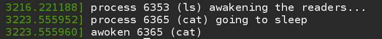
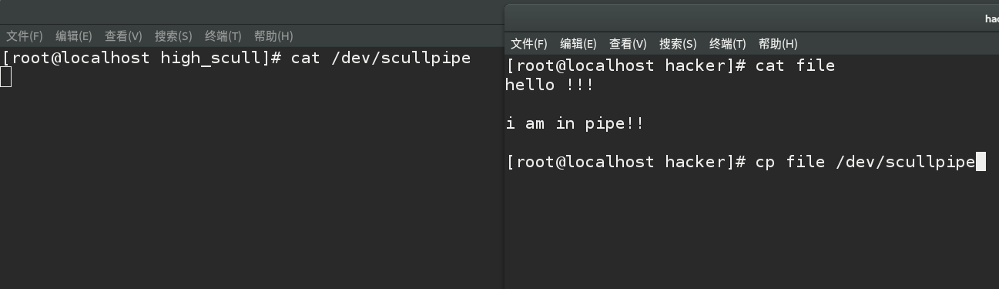
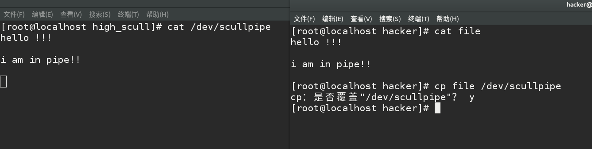
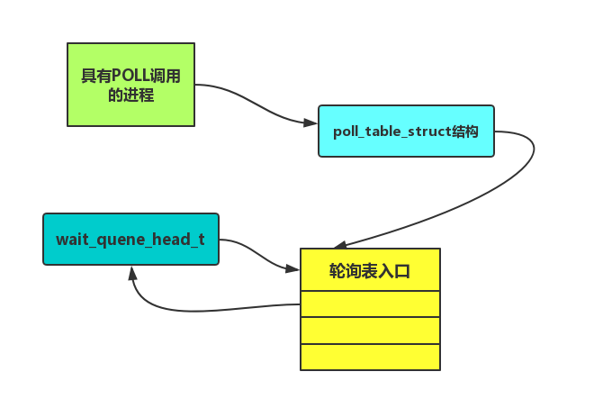

## 关于IO的高级话题

### 阻塞型IO --休眠

让一个进程进入休眠状态是很容易的，但是我们必须考虑如何不让他“一睡不醒”。其中有几个重要的规则我们必须遵守。

1.永远不要在原子的上下文中进入睡眠。尤其驱动程序不能在拥有自旋锁，seqlock或者RCU锁时休眠。如果我们已经禁止中断也不能使休眠。所以休眠的信号量必须很小。

2.当我们被唤醒时，我们不能对睡眠时间作任何的假设，因此必须检查确保我们等待的条件为真。

3.除非我们知道其他人会在某一个地方唤醒我门，否则进程不能进入休眠状态。


休眠的几个内核函数接口：

“include/linux/wait.h”

```
等待队列：
struct __wait_queue {
	unsigned int		flags;
	void			*private;
	wait_queue_func_t	func;
	struct list_head	task_list;
};

   
/**
 * wait_event - sleep until a condition gets true
 * @wq: the waitqueue to wait on
 * @condition: a C expression for the event to wait for
 *
 * The process is put to sleep (TASK_UNINTERRUPTIBLE) until the
 * @condition evaluates to true. The @condition is checked each time
 * the waitqueue @wq is woken up.
 *
 * wake_up() has to be called after changing any variable that could
 * change the result of the wait condition.
 */
 
#define wait_event(wq, condition)					\
do {									\
	might_sleep();							\
	if (condition)							\
		break;							\
	__wait_event(wq, condition);					\
} while (0)

简单来说使用这个函数，我们就会被置于非中断休眠，屏蔽中断的休眠方式，还有非屏蔽中断休眠，它可以被某个信号中断。我们这里就写这一个例子。

wake_up 唤醒操作
#define wake_up(x)			__wake_up(x, TASK_NORMAL, 1, NULL)
void __wake_up(wait_queue_head_t *q, unsigned int mode, int nr, void *key;

```
在CODE中有一个SLEEP 的模块，具有一个简单的行为设备：任何试图从该设备上读取的进程均被放置到休眠态，只要某个进程向该设备写入，所有的休眠进程就会被唤醒。./code/sleepy.c

效果如下：

我们加载完成小模块后，对它进行一个读行为cat ，一个写行为 ls > 重定向。

友情提示：这里光加载模块是不够的，需要使用mknod 命令创建设备，不清楚的读者可以参考前文：

还是帮助下大家:
```
 insmod sleepy.ko
 mknod /dev/sleepy c 247 0

```




读取的进程被睡眠，写的进程被读取。


## 阻塞和非阻塞操作

一般情况下，如果我们需要设置非阻塞操作，直接可以设置set_noblock 标志关键字。其实内核的处理是非常简单而且直接的， 检查是否设置非阻塞标志，如果没有设置就调用wait_sleep睡眠，设置了做好处理直接返回，非阻塞并没有什么厉害的。

我们来讨论缓冲区在阻塞中的使用，大多数情况下而言，实现缓冲区可以提高性能，减少了上下文的切换和用户调用的次数。仅此而已，关键标志O_NONBLOCK.

在高级的字符驱动设备中，我们的scullpipe驱动程序，阻塞在我们的read调用的进程在数据到达时被唤醒，通常硬件会发出一个中断来处理，然后作为中断处理的一部分，驱动程序会唤醒等待进程。我们选择另一个进程来产生数据并唤醒读取进程，读取进程用来唤醒等待缓冲区空间可用的写入进程。

我们在read_p 中添加了阻塞相关的内容，书P155.

## 进程如何休眠？

1.初始化一个wait_queue_t 的等待队列。

2.设置进程状态，设置休眠状态。

3.放弃处理器，在这之前我们必须要检查是否满足唤醒条件，不然会丧失最后唤醒的机会永远睡眠下去。即使唤醒发生在这里两个操作中间，休眠会把进程修改成RUNING状态，schedule()会立即返回。


## 测试SCULLPIPE 程序

我们向设备读取文件，然后肯定会阻塞，然后我们在另一个进程中读取文件，可以看到之前睡眠的读取进程被唤醒，读取成功。
我们用cat读取 用cp 写入



读取完成。


## 接着POLL和SELECT
学过网络编程的同学都清楚这两个调用是干什么的，用来等待个文件流的操作。
其实这并不是网络编程的专利，在内核中本来就是一种监听等待的机制。书上说的很明白，我们来看看他的数据结构图。



很简单，当我们调用POLL的时候其实就创建了一个POLL_TABLE添加一个等待的队列，而这个队列上有三个结构项
1.指向被打开的文件类型指针。
2.一个等待队列指针。
3.一个关联的等待队列入口。

如果轮询时没有一个可以进行非阻塞IO，进入休眠。有IO则返回一个掩码。
从图中我们也能看出来EPOLL出现的原因了，在典型情况下，对POLL或者SELSECT的调用只涉及到几个文件描述符，当我们需要使用很多描述符的时候处理成本增大，
所以才有了EPOLL只需要一次构造内部内核数据结构，然后多次使用。


#### 简单异步实现
1.指定一个进程作为文件的“属主”，fcntl系统调用执行F_SETSHOW时，属主的PID被保存到filp->f_owner 中。

2.当输入文件有数据时，请求发送一个ISGIO信号。该信号被发送到存放在filp->f_owner中的进程，如果是负值，就发送给进程组。

