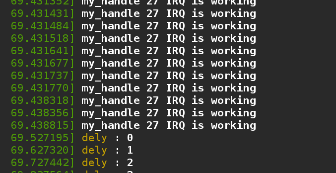

## 中断处理

首先，关于中断和异常的概念，可以参考我的博客，或者等后边的同学进行补充，我们不再这里赘述。我们尽可能的讨论一些进阶的东西。


### /proc 接口

如图：我们可以在/proc/interrupts 中看到我们系统中安装的中断。


可以看到，我的电脑是有4个CPU ，其实是双核4线程，看来内核是以执行流的来作为CPU的计数标准。

第一列是IRQ中断号，最后一列是中断的名称，中间是每个CPU处理中断的计数。

我们可以发现即使我的个人PC并没有运行太多的服务和程序，但是CPU0明显还是处理的中断更多，这是LINUX内核为了最大化缓存的本地性质。

接着我们来看看/proc/stat 文件。

这个文件中记录的是系统活动的底层统计信息，包括从系统启动到现在系统接受的中断数量。


可以看到这是一个使用位图的表达方式。

### 中断接口

请求中断线 && 中断描述符：

```
/**
 * struct irqaction - per interrupt action descriptor
 * @handler:	interrupt handler function
 * @name:	name of the device
 * @dev_id:	cookie to identify the device
 * @percpu_dev_id:	cookie to identify the device
 * @next:	pointer to the next irqaction for shared interrupts
 * @irq:	interrupt number
 * @flags:	flags (see IRQF_* above)
 * @thread_fn:	interrupt handler function for threaded interrupts
 * @thread:	thread pointer for threaded interrupts
 * @secondary:	pointer to secondary irqaction (force threading)
 * @thread_flags:	flags related to @thread
 * @thread_mask:	bitmask for keeping track of @thread activity
 * @dir:	pointer to the proc/irq/NN/name entry
 */
struct irqaction {
	irq_handler_t		handler;
	void			*dev_id;
	void __percpu		*percpu_dev_id;
	struct irqaction	*next;
	irq_handler_t		thread_fn;
	struct task_struct	*thread;
	struct irqaction	*secondary;
	unsigned int		irq;
	unsigned int		flags;
	unsigned long		thread_flags;
	unsigned long		thread_mask;
	const char		*name;
	struct proc_dir_entry	*dir;
} ____cacheline_internodealigned_in_smp;


static inline int __must_check
request_irq(unsigned int irq, irq_handler_t handler, unsigned long flags,
	    const char *name, void *dev)
{
	return request_threaded_irq(irq, handler, NULL, flags, name, dev);
}

@irq             要申请的中断号
@handler_t       安装处理中断的函数指针
@flags           中断掩码
@name            中断拥有者
@dev             中断信号线

```

#### 实现中断程序的几个简单要求

1.处理例程不能向用户空间发送或者接受数据，因为它不能再进程上下文中执行，处理过程也不能休眠。

2.不能调用schdule函数

#### 典型应用

如果中断通知进程所等待的事件已经发生，比如新数据到达，就会唤醒在该设备上休眠的进程。我们最好编写执行时间尽可能短的处理例程。
如果需要长时间的计算任务最好的使用方法是tasklet 或者 工作队列在更加安全的时间计算。

### 注册中断函数小测试

我们以共享形式在27号中断线设置一个中断处理函数，27号是PCI上的一个周期中断。代码在./code  中。

测试效果：


随着我们系统上27号中断线收到中断请求，我们注册的中断处理信息也被打印。此处是共享了中断线。

### 中断线探测

此处，暂时不作为主要讨论内容，代后续补充，内核已经为我们提供了API。

以下一些材料来自内核源码，供读者参考。

```
/*
 * Autoprobing for irqs:
 *
 * probe_irq_on() and probe_irq_off() provide robust primitives
 * for accurate IRQ probing during kernel initialization.  They are
 * reasonably simple to use, are not "fooled" by spurious interrupts,
 * and, unlike other attempts at IRQ probing, they do not get hung on
 * stuck interrupts (such as unused PS2 mouse interfaces on ASUS boards).
 *
 * For reasonably foolproof probing, use them as follows:
 *
 * 1. clear and/or mask the device's internal interrupt.
 * 2. sti();
 * 3. irqs = probe_irq_on();      // "take over" all unassigned idle IRQs
 * 4. enable the device and cause it to trigger an interrupt.
 * 5. wait for the device to interrupt, using non-intrusive polling or a delay.
 * 6. irq = probe_irq_off(irqs);  // get IRQ number, 0=none, negative=multiple
 * 7. service the device to clear its pending interrupt.
 * 8. loop again if paranoia is required.
 *
 * probe_irq_on() returns a mask of allocated irq's.
 *
 * probe_irq_off() takes the mask as a parameter,
 * and returns the irq number which occurred,
 * or zero if none occurred, or a negative irq number
 * if more than one irq occurred.
 */

#if !defined(CONFIG_GENERIC_IRQ_PROBE) 
static inline unsigned long probe_irq_on(void)
{
	return 0;
}
static inline int probe_irq_off(unsigned long val)
{
	return 0;
}
static inline unsigned int probe_irq_mask(unsigned long val)
{
	return 0;
}
```


### 下半部处理机制

中断处理过程必须快速，但是我们很多时候需要一些执行时间较长的流程，为了解决这个问题，内核提供了下半部机制。

下半部机制唯一的不同，在于处理历程在执行的过程中，中断是打开的，可以继续响应中断，一共有两种实现方式，一个是tasklet 一个是工作队列。

#### tasklet 
tasklet是中断处理下半部分最常用的一种方法，驱动程序一般先申请中断，在中断处理函数内完成中断上半部分的工作后调用tasklet。tasklet有如下特点：

1.tasklet只可以在一个CPU上同步地执行，不同的tasklet可以在不同地CPU上同步地执行。

2.tasklet的实现是建立在两个软件中断的基础之上的，即HI_SOFTIRQ和TASKLET_SOFTIRQ，本质上没有什么区别，只不过HI_SOFTIRQ的优先级更高一些

3.由于tasklet是在软中断上实现的，所以像软中断一样不能睡眠、不能阻塞，处理函数内不能含有导致睡眠的动作，如减少信号量、从用户空间拷贝数据或手工分配内存等。

4.一个 tasklet 能够被禁止并且之后被重新使能; 它不会执行直到它被使能的次数与被禁止的次数相同.

5.tasklet的串行化使tasklet函数不必是可重入的，因此简化了设备驱动程序开发者的工作。

6.每个cpu拥有一个tasklet_vec链表，具体是哪个cpu的tasklet_vec链表，是根据当前线程是运行在哪个cpu来决定的。

在CODE目录中，我们的tasklet 代码中，实现了一个简单的tasklet 程序。

效果如下：



可以看到中断被触发，但是并没有每次都执行我们的100次打印循环，进一步的你可以观察到，在执行100此打印的过程中，也会被打断。
小心：你在实验的时候不要设置100次循环，找一个中断少点的中断线，不然容易挂，，，，哈哈哈。

####  工作队列

linux的工作队列（workqueue）是另外一种将工作推后执行的形式，它和软中断、tasklet 这两种下半部机制都有不同。工作队列可以把工作推后，交由一个内核线程去执行，也就是说，这个下半部分可以在进程上下文中执行。这样，通过工作队列执行的代码能占尽进程上下文的所有优势。最重要的就是工作队列允许被重新调度甚至是睡眠。 


