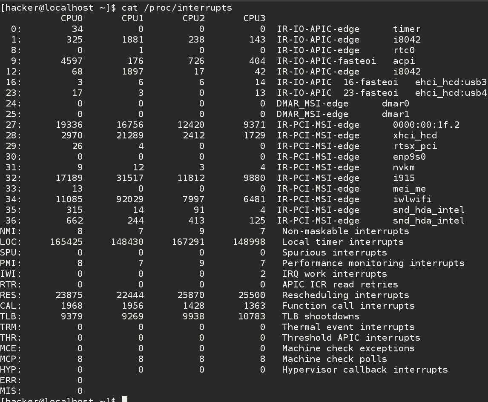
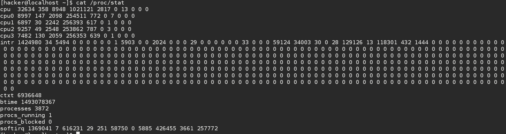

## 中断处理

首先，关于中断和异常的概念，可以参考我的博客，或者等后边的同学进行补充，我们不再这里赘述。我们尽可能的讨论一些进阶的东西。


### /proc 接口

如图：我们可以在/proc/interrupts 中看到我们系统中安装的中断。



可以看到，我的电脑是有4个CPU ，其实是双核4线程，看来内核是以执行流的来作为CPU的计数标准。

第一列是IRQ中断号，最后一列是中断的名称，中间是每个CPU处理中断的计数。

我们可以发现即使我的个人PC并没有运行太多的服务和程序，但是CPU0明显还是处理的中断更多，这是LINUX内核为了最大化缓存的本地性质。

接着我们来看看/proc/stat 文件。

这个文件中记录的是系统活动的底层统计信息，包括从系统启动到现在系统接受的中断数量。




可以看到这是一个使用位图的表达方式。

### 中断接口

请求中断线 && 中断描述符：

```
/**
 * struct irqaction - per interrupt action descriptor
 * @handler:	interrupt handler function
 * @name:	name of the device
 * @dev_id:	cookie to identify the device
 * @percpu_dev_id:	cookie to identify the device
 * @next:	pointer to the next irqaction for shared interrupts
 * @irq:	interrupt number
 * @flags:	flags (see IRQF_* above)
 * @thread_fn:	interrupt handler function for threaded interrupts
 * @thread:	thread pointer for threaded interrupts
 * @secondary:	pointer to secondary irqaction (force threading)
 * @thread_flags:	flags related to @thread
 * @thread_mask:	bitmask for keeping track of @thread activity
 * @dir:	pointer to the proc/irq/NN/name entry
 */
struct irqaction {
	irq_handler_t		handler;
	void			*dev_id;
	void __percpu		*percpu_dev_id;
	struct irqaction	*next;
	irq_handler_t		thread_fn;
	struct task_struct	*thread;
	struct irqaction	*secondary;
	unsigned int		irq;
	unsigned int		flags;
	unsigned long		thread_flags;
	unsigned long		thread_mask;
	const char		*name;
	struct proc_dir_entry	*dir;
} ____cacheline_internodealigned_in_smp;


static inline int __must_check
request_irq(unsigned int irq, irq_handler_t handler, unsigned long flags,
	    const char *name, void *dev)
{
	return request_threaded_irq(irq, handler, NULL, flags, name, dev);
}

@irq             要申请的中断号
@handler_t       安装处理中断的函数指针
@flags           中断掩码
@name            中断拥有者
@dev             中断信号线

```

#### 实现中断程序的几个简单要求

1.处理例程不能向用户空间发送或者接受数据，因为它不能再进程上下文中执行，处理过程也不能休眠。

2.不能调用schdule函数

#### 典型应用

如果中断通知进程所等待的事件已经发生，比如新数据到达，就会唤醒在该设备上休眠的进程。我们最好编写执行时间尽可能短的处理例程。
如果需要长时间的计算任务最好的使用方法是tasklet 或者 工作队列在更加安全的时间计算。

### 注册中断函数小测试

我们以共享形式在27号中断线设置一个中断处理函数，27号是PCI上的一个周期中断。代码在./code  中。

测试效果：


随着我们系统上27号中断线收到中断请求，我们注册的中断处理信息也被打印。


