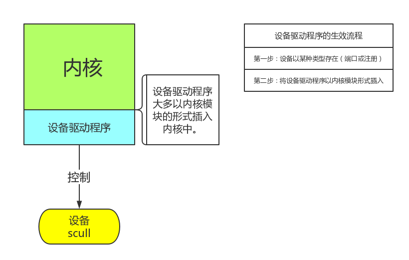
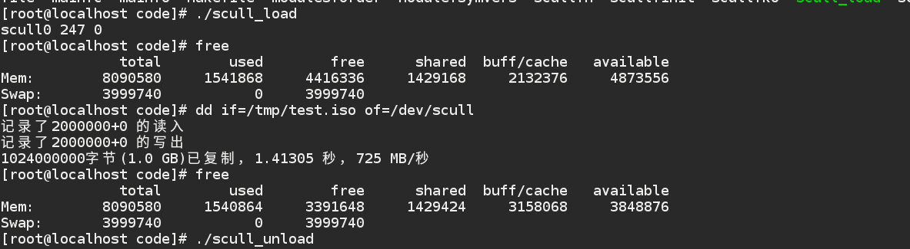

##scull 字符设备驱动程序的设备描述

字符设备驱动程序是分配一段内存，然后提供对这个设备的管理方式，我们通过它提供的操作来操纵字符驱动设备，本质上是一个我们分配的模拟内存来模拟驱动设备。

结构如下：


几个重要方法，我们最初只提供几个简单的接口函数。

read : 拷贝数据到应用程序空间。

write: 拷贝数据到内核空间，在这里就是我们的字符驱动设备。

open : 打开并且初始化设备。


字符设备驱动程序几个重要的数据结构：

```
struct scull_dev {
	struct scull_qset *data;  /* Pointer to first quantum set */
	int quantum;              /* the current quantum size */
	int qset;                 /* the current array size */
	unsigned long size;       /* amount of data stored here */
	unsigned int access_key;  /* used by sculluid and scullpriv */
	struct semaphore sem;     /* mutual exclusion semaphore     */
	struct cdev cdev;	  /* Char device structure		*/
};
```

```
struct cdev {
	struct kobject kobj;
	struct module *owner;
	const struct file_operations *ops;
	struct list_head list;
	dev_t dev;
	unsigned int count;
};
```

```
struct inode {
	umode_t			i_mode;
	unsigned short		i_opflags;
	kuid_t			i_uid;
	kgid_t			i_gid;
	unsigned int		i_flags;

#ifdef CONFIG_FS_POSIX_ACL
	struct posix_acl	*i_acl;
	struct posix_acl	*i_default_acl;
#endif

	const struct inode_operations	*i_op;
	struct super_block	*i_sb;
	struct address_space	*i_mapping;

#ifdef CONFIG_SECURITY
	void			*i_security;
#endif

	/* Stat data, not accessed from path walking */
	unsigned long		i_ino;
	/*
	 * Filesystems may only read i_nlink directly.  They shall use the
	 * following functions for modification:
	 *
	 *    (set|clear|inc|drop)_nlink
	 *    inode_(inc|dec)_link_count
	 */
	union {
		const unsigned int i_nlink;
		unsigned int __i_nlink;
	};
	dev_t			i_rdev;
	loff_t			i_size;
	struct timespec		i_atime;
	struct timespec		i_mtime;
	struct timespec		i_ctime;
	spinlock_t		i_lock;	/* i_blocks, i_bytes, maybe i_size */
	unsigned short          i_bytes;
	unsigned int		i_blkbits;
	blkcnt_t		i_blocks;

#ifdef __NEED_I_SIZE_ORDERED
	seqcount_t		i_size_seqcount;
#endif

	/* Misc */
	unsigned long		i_state;
	struct mutex		i_mutex;

	unsigned long		dirtied_when;	/* jiffies of first dirtying */
	unsigned long		dirtied_time_when;

	struct hlist_node	i_hash;
	struct list_head	i_io_list;	/* backing dev IO list */
#ifdef CONFIG_CGROUP_WRITEBACK
	struct bdi_writeback	*i_wb;		/* the associated cgroup wb */

	/* foreign inode detection, see wbc_detach_inode() */
	int			i_wb_frn_winner;
	u16			i_wb_frn_avg_time;
	u16			i_wb_frn_history;
#endif
	struct list_head	i_lru;		/* inode LRU list */
	struct list_head	i_sb_list;
	union {
		struct hlist_head	i_dentry;
		struct rcu_head		i_rcu;
	};
	u64			i_version;
	atomic_t		i_count;
	atomic_t		i_dio_count;
	atomic_t		i_writecount;
#ifdef CONFIG_IMA
	atomic_t		i_readcount; /* struct files open RO */
#endif
	const struct file_operations	*i_fop;	/* former ->i_op->default_file_ops */
	struct file_lock_context	*i_flctx;
	struct address_space	i_data;
	struct list_head	i_devices;
	union {
		struct pipe_inode_info	*i_pipe;
		struct block_device	*i_bdev;
		struct cdev		*i_cdev;
		char			*i_link;
	};

	__u32			i_generation;

#ifdef CONFIG_FSNOTIFY
	__u32			i_fsnotify_mask; /* all events this inode cares about */
	struct hlist_head	i_fsnotify_marks;
#endif

	void			*i_private; /* fs or device private pointer */
};
```


```
struct file {
	union {
		struct llist_node	fu_llist;
		struct rcu_head 	fu_rcuhead;
	} f_u;
	struct path		f_path;
	struct inode		*f_inode;	/* cached value */
	const struct file_operations	*f_op;

	/*
	 * Protects f_ep_links, f_flags.
	 * Must not be taken from IRQ context.
	 */
	spinlock_t		f_lock;
	atomic_long_t		f_count;
	unsigned int 		f_flags;
	fmode_t			f_mode;
	struct mutex		f_pos_lock;
	loff_t			f_pos;
	struct fown_struct	f_owner;
	const struct cred	*f_cred;
	struct file_ra_state	f_ra;

	u64			f_version;
#ifdef CONFIG_SECURITY
	void			*f_security;
#endif
	/* needed for tty driver, and maybe others */
	void			*private_data;

#ifdef CONFIG_EPOLL
	/* Used by fs/eventpoll.c to link all the hooks to this file */
	struct list_head	f_ep_links;
	struct list_head	f_tfile_llink;
#endif /* #ifdef CONFIG_EPOLL */
	struct address_space	*f_mapping;
} __attribute__((aligned(4)));	/* lest something weird decides that 2 is OK */

struct file_handle {
	__u32 handle_bytes;
	int handle_type;
	/* file identifier */
	unsigned char f_handle[0];
};
```

```
struct file_operations {
	struct module *owner;
	loff_t (*llseek) (struct file *, loff_t, int);
	ssize_t (*read) (struct file *, char __user *, size_t, loff_t *);
	ssize_t (*write) (struct file *, const char __user *, size_t, loff_t *);
	ssize_t (*read_iter) (struct kiocb *, struct iov_iter *);
	ssize_t (*write_iter) (struct kiocb *, struct iov_iter *);
	int (*iterate) (struct file *, struct dir_context *);
	unsigned int (*poll) (struct file *, struct poll_table_struct *);
	long (*unlocked_ioctl) (struct file *, unsigned int, unsigned long);
	long (*compat_ioctl) (struct file *, unsigned int, unsigned long);
	int (*mmap) (struct file *, struct vm_area_struct *);
	int (*open) (struct inode *, struct file *);
	int (*flush) (struct file *, fl_owner_t id);
	int (*release) (struct inode *, struct file *);
	int (*fsync) (struct file *, loff_t, loff_t, int datasync);
	int (*aio_fsync) (struct kiocb *, int datasync);
	int (*fasync) (int, struct file *, int);
	int (*lock) (struct file *, int, struct file_lock *);
	ssize_t (*sendpage) (struct file *, struct page *, int, size_t, loff_t *, int);
	unsigned long (*get_unmapped_area)(struct file *, unsigned long, unsigned long, unsigned long, unsigned long);
	int (*check_flags)(int);
	int (*flock) (struct file *, int, struct file_lock *);
	ssize_t (*splice_write)(struct pipe_inode_info *, struct file *, loff_t *, size_t, unsigned int);
	ssize_t (*splice_read)(struct file *, loff_t *, struct pipe_inode_info *, size_t, unsigned int);
	int (*setlease)(struct file *, long, struct file_lock **, void **);
	long (*fallocate)(struct file *file, int mode, loff_t offset,
			  loff_t len);
	void (*show_fdinfo)(struct seq_file *m, struct file *f);
#ifndef CONFIG_MMU
	unsigned (*mmap_capabilities)(struct file *);
#endif
};
```


## 设备驱动程序设计的基本框架



1.申请设备号，主，次设备号。

2.构建我们的设备结构。

3.编写fops的内核提供的操作方法，更新fops指针。

4.注册我们的设备。


## 测试结果



我们可以看到，当给我们的scull新设备写入数据的时候，使用free命令就可以看到内存被成功占用。

这里有一个重要问题：

###如何安全的将数据在用户空间和逻辑空间之间拷贝？

####解决方法：内核提供了安全的拷贝函数：
copy_to_user
copy_from_user

关于这两个函数有一篇博客描述的比较清楚：

http://blog.csdn.net/ce123_zhouwei/article/details/8454226


unsigned long copy_to_user(void __user *to, const void *from, unsigned long n);

如果数据拷贝成功，则返回零；否则，返回没有拷贝成功的数据字节数。

*to是用户空间的指针，

*from是内核空间指针，

n表示从内核空间向用户空间拷贝数据的字节数。


-----------------------------------------------------------------------------------
功能：用于将用户空间的数据传送到内核空间。

unsigned long copy_from_user(void * to, const void __user * from, unsigned long n)

第一个参数to是内核空间的数据目标地址指针，

第二个参数from是用户空间的数据源地址指针，

第三个参数n是数据的长度。

如果数据拷贝成功，则返回零；否则，返回没有拷贝成功的数据字节数。

此函数将from指针指向的用户空间地址开始的连续n个字节的数据产送到to指针指向的内核空间地址.


