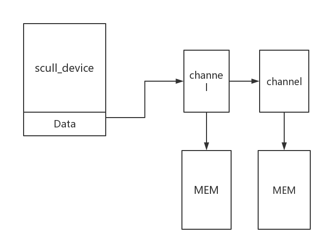

##scull 字符设备驱动程序的设备描述

字符设备驱动程序是分配一段内存，然后提供对这个设备的管理方式，我们通过它提供的操作来操纵字符驱动设备，本质上是一个我们分配的模拟内存来模拟驱动设备。

结构如下：

几个重要方法：

read : 拷贝数据到应用程序空间。

write: 拷贝数据到内核空间，在这里就是我们的字符驱动设备。

这里有一个重要问题：

###如何安全的将数据在用户空间和逻辑空间之间拷贝？

####解决方法：内核提供了安全的拷贝函数：
copy_to_user
copy_from_user

关于这两个函数有一篇博客描述的比较清楚：

http://blog.csdn.net/ce123_zhouwei/article/details/8454226

unsigned long copy_to_user(void __user *to, const void *from, unsigned long n);

如果数据拷贝成功，则返回零；否则，返回没有拷贝成功的数据字节数。

*to是用户空间的指针，

*from是内核空间指针，

n表示从内核空间向用户空间拷贝数据的字节数。

-----------------------------------------------------------------------------------
功能：用于将用户空间的数据传送到内核空间。

unsigned long copy_from_user(void * to, const void __user * from, unsigned long n)

第一个参数to是内核空间的数据目标地址指针，

第二个参数from是用户空间的数据源地址指针，

第三个参数n是数据的长度。

如果数据拷贝成功，则返回零；否则，返回没有拷贝成功的数据字节数。

此函数将from指针指向的用户空间地址开始的连续n个字节的数据产送到to指针指向的内核空间地址

