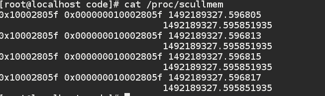
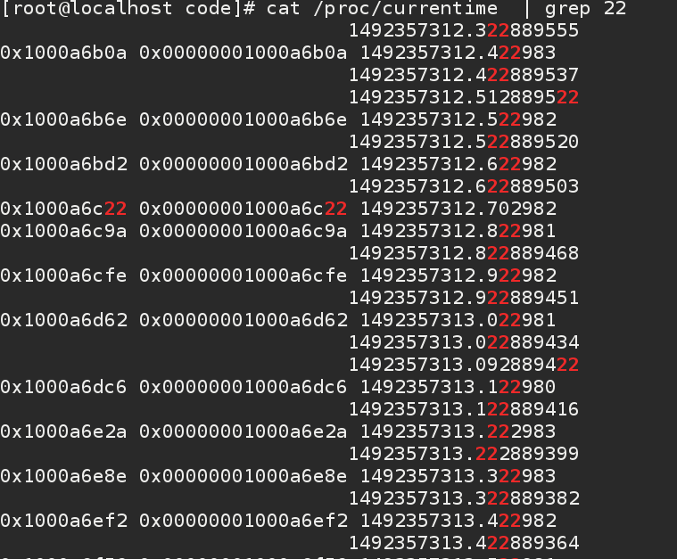

## 内核时间，延时与缓存

## 时间

内核通过定时器中断来跟踪时间流，记录每次时钟周期的滴答数，现代大多数默认时1000HZ ，每次开机后内核会初始化时间变量，然后每过一个时钟周期，变量加一，我们应当充分的信任内核不要随便去改动，除非有特殊的理由。

jiffies 变量用来存储时钟中断次数，是一个64位的无符号长整形。它的访问一直是原子的。

内核定义：

```
extern u64 __jiffy_data jiffies_64;
extern unsigned long volatile __jiffy_data jiffies;

```

比较当前值和缓存值的几个宏：

```
#define time_after(a,b)		\
	(typecheck(unsigned long, a) && \
	 typecheck(unsigned long, b) && \
	 ((long)((b) - (a)) < 0))
#define time_before(a,b)	time_after(b,a)

#define time_after_eq(a,b)	\
	(typecheck(unsigned long, a) && \
	 typecheck(unsigned long, b) && \
	 ((long)((a) - (b)) >= 0))
#define time_before_eq(a,b)	time_after_eq(b,a)

```
时钟中断计时法和现实时间的转化。

```
static __always_inline unsigned long usecs_to_jiffies(const unsigned int u);
extern unsigned long timespec64_to_jiffies(const struct timespec64 *value);
extern void jiffies_to_timespec64(const unsigned long jiffies,truct timespec64 *value);
static inline unsigned long timespec_to_jiffies(const struct timespec *value);
static inline void jiffies_to_timespec(const unsigned long jiffies,struct timespec *value);
extern unsigned long timeval_to_jiffies(const struct timeval *value);
extern void jiffies_to_timeval(const unsigned long jiffies, struct timeval *value);
extern clock_t jiffies_to_clock_t(unsigned long x);
extern unsigned long clock_t_to_jiffies(unsigned long x);
```

使用64位寄存器直接获取变量。
static inline u64 get_jiffies_64(void)
{
	return (u64)jiffies;
}


内核就是通过这个全局的变量来获取时间的，一般来说驱动程序是不需要知道墙上时间的，真实世界时间一般放在用户空间使用。

在CODE代码中有一个获取时间模块，我们加载后，可以从/proc/currentime中获取当前时间 
 
结果如下



### 延时

有时我们需要延时比较长的时间，内核给我们提供了一个函数time_before(jiffies,j1) ，这个函数用来不挺的测试jiffies 是否超过了我们设置的j1如果超过了则返回一个负值。
我们使用如下的代码来忙等待我们设置的值。


```
case JIT_BUSY:
			while (time_before(jiffies, j1))
			break;
			
```

我们执行cat 这个命令会不断的调用read ,我们每次查找其中含有22字符的信息，可以发现他是有我们设置的延时的。结果如下：



此处需要实践运行才能看出来，截图看不出来等待。


一个需要注意的问题是， 如果我们需要等待，最好调用schedule();让出处理器，效果差不多，直接提高效率，此处不再测试。

```
case JIT_SCHED:
			while (time_before(jiffies, j1)) {
				schedule();
			}
			break;
```


####  短延时

当我们需要非常短暂的延时，使用时钟中断显然不是一个好方法，内核给我们提供了一些精度更高的延时函数，这是根据CPU 硬件不同设置不同的。我们不需要关心实现，首先看看定义"linux/delay.h"

```
void calibrate_delay(void);
void msleep(unsigned int msecs);
unsigned long msleep_interruptible(unsigned int msecs);
void usleep_range(unsigned long min, unsigned long max);

static inline void ssleep(unsigned int seconds)
{
	msleep(seconds * 1000);
}
```


